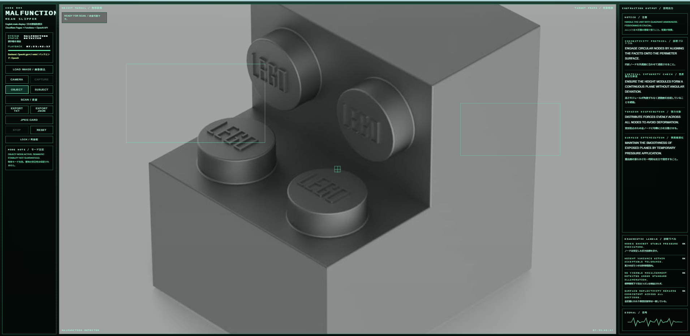

# CODE 904 / MALFUNCTION / MEAN SLIPPER

レトロなHUD風インターフェースで、画像から
**「もっともらしいが役に立たない説明書」**を生成するWebアプリ。

Cloudflare Pages + Functions + OpenAI API を使用し、
パスワード制限付きで安全に運用されています。

---

## 🧪 Demo

👉 https://code-904.pages.dev

---

## 📸 Screenshots

### 実行画面

### 保存されたJPEG

---

## ✨ Features

* 画像アップロード / カメラ撮影
* OBJECT / SUBJECT モード
* 英語（主）＋日本語（補助）の擬似説明生成
* TXT / JSON / JPEG（共有カード）出力
* パスワード制限アクセス
* OpenAI APIキーはサーバー側で安全管理

---

## 🧠 Concept

このアプリは、

> **「説明しようとするシステムが、説明に失敗している状態」**

を可視化します。

* 物体 → 機能のようで機能しない記述
* 人物 → ログのようで意味を確定しない観測

**意味と無意味の境界を操作するインターフェース**です。

---

## 🛠 Tech Stack

* Frontend: Vanilla JS + Canvas
* Backend: Cloudflare Pages Functions
* AI: OpenAI Responses API（画像入力対応）
* Hosting: Cloudflare Pages
* Security: Cloudflare Secrets + Password Auth

---

## 🧾 Usage

1. ページを開く
2. パスワード入力
3. 画像を読み込む or 撮影
4. モード選択
5. SCAN
6. 保存（TXT / JSON / JPEG）

---

## 🖼 JPEG Output

共有カードとして生成：

* 画像 + 説明文 + HUD
* SNS投稿に最適化されたレイアウト
* 長文は自動圧縮（意味は保持されない）

---

## ⚠️ Notes

* 実用的な説明は生成されません
* 人物モードでは個人識別を行いません
* 限定共有用途を想定しています

---

## 📄 License

MIT

---

## 🧑‍💻 Author

MASATO

---

## 💡 Statement

これは説明書ではない。

**意味を与える機械が、意味を崩壊させる瞬間のログである。**
