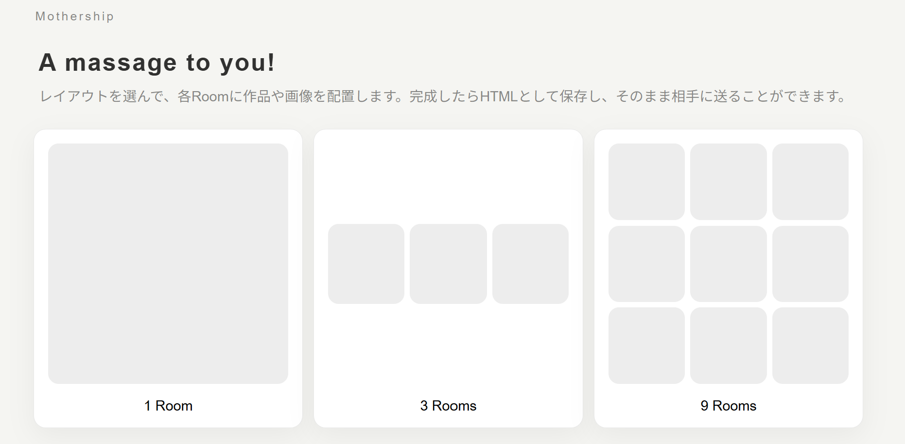
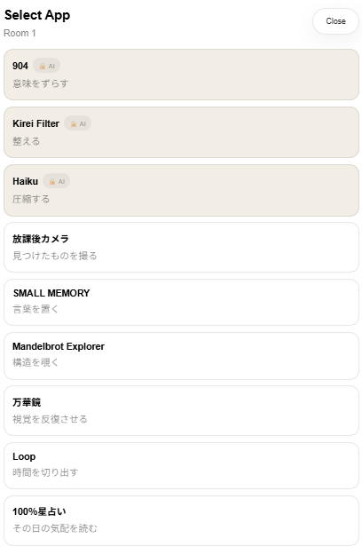
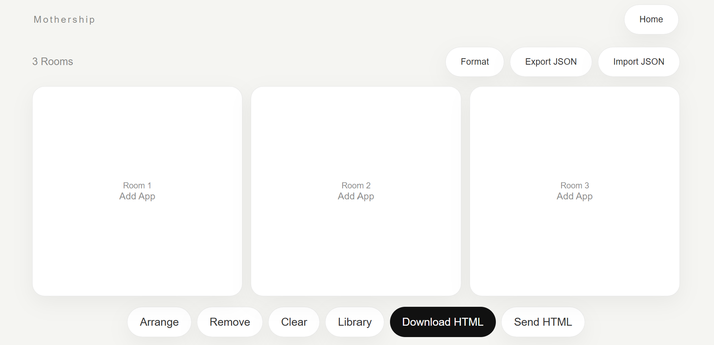

# Mothership

**A massage to you!**

Mothership は、複数の小さなアプリや作品を Room に配置し、ひとつの小さな展示室として相手に送るための PWA です。

レイアウトを選んで、各 Room に作品や画像を配置します。完成したら HTML として保存し、そのまま相手に送ることができます。

---

## 実行ページ

https://mothership-8ii.pages.dev/

---

## PWA としてインストールする方法

### iPhone / iPad

1. Safari で実行ページを開きます。
2. 共有ボタンを押します。
3. 「ホーム画面に追加」を選びます。
4. ホーム画面から Mothership を起動します。

### Android

1. Chrome で実行ページを開きます。
2. メニューから「ホーム画面に追加」または「アプリをインストール」を選びます。
3. ホーム画面から Mothership を起動します。

### PC

1. Chrome または Edge で実行ページを開きます。
2. アドレスバー右側のインストールアイコンを押します。
3. アプリとして起動します。

---

## コンセプト

Mothership は、単なるアプリ集ではありません。

小さなアプリ、画像、動画、生成した作品を Room に入れて、ひとつの「送れる展示室」としてまとめるためのツールです。

作る人は Mothership 上で Room を編集します。受け取る人は、書き出された HTML を開くだけで、その展示室を見ることができます。

相手に複数のアプリをインストールしてもらう必要はありません。完成した HTML を送るだけで、作品や体験を渡すことができます。

---

## できること

- 1 Room / 3 Rooms / 9 Rooms のレイアウトを選べます。
- 各 Room に画像、動画、作品、アプリの出力を配置できます。
- 内蔵アプリで作った結果を **USE IN ROOM** で Room に反映できます。
- JSON で編集状態をバックアップできます。
- JSON を読み込んで編集状態を復元できます。
- 完成した Room 構成を HTML として保存できます。
- 保存した HTML をそのまま相手に送れます。
- 受け取った人は、アプリ本体を入れなくても HTML を開いて見ることができます。

---

## 内蔵アプリ

Mothership には、小さな実験的アプリが入っています。

例：

- 俳句アプリ
- Small Memory
- Mandelbrot
- 万華鏡
- Loop
- 星占い
- カメラ系アプリ

各アプリは、基本的に **USE IN ROOM** で選択中の Room に結果を反映します。

一部の Room は画像や動画として表示されます。星占いのように、Room からアプリ体験を開くタイプもあります。

---

## 使い方

1. Mothership を開きます。
2. Room のレイアウトを選びます。
3. 編集したい Room を選びます。
4. アプリを選ぶか、画像・動画などを追加します。
5. アプリ内で作品を作ります。
6. **USE IN ROOM** を押して Room に反映します。
7. 他の Room も同じように編集します。
8. **Download HTML** を押します。
9. 書き出された HTML ファイルを相手に送ります。

---

## 書き出し機能

### Export JSON

現在の Mothership の編集状態を JSON として保存します。あとで続きを編集したいときに使います。

### Import JSON

以前に保存した JSON を読み込み、編集状態を復元します。

### Download HTML

現在の Room 構成を、相手に送れる HTML ファイルとして保存します。

### Send HTML

対応している端末では、共有メニューから HTML を送れます。共有に対応していない環境では、Download HTML を使って保存できます。

---

## スクリーンショット

### ホーム / Room レイアウト

### アプリ選択

### Room 表示

---

## 作る側と受け取る側

### 作る側

作る人は、Room を選び、アプリを使い、画像や動画を配置し、完成した展示室を作ります。

### 受け取る側

受け取る人は、送られてきた HTML を開くだけで、Room に入った作品や体験を見ることができます。

この分離によって、作る側は自由に編集でき、受け取る側は軽く見るだけで楽しめます。

---

## プライバシー

Mothership は、できるだけローカルで完結する小さなツールとして作っています。

画像や動画、JSON、HTML の保存は、基本的にユーザーの端末上で行われます。

カメラを使うアプリでは、ブラウザがカメラ許可を求めます。カメラ機能は HTTPS 環境で動作します。

---

## 技術構成

- HTML
- CSS
- JavaScript
- PWA
- Service Worker
- Cloudflare Pages

---

## 作者

MASATO NASU  
Product designer / computational experiments

Personal Lab:  
https://masato-lab.pages.dev/

---

## ライセンス

Personal / experimental project.
