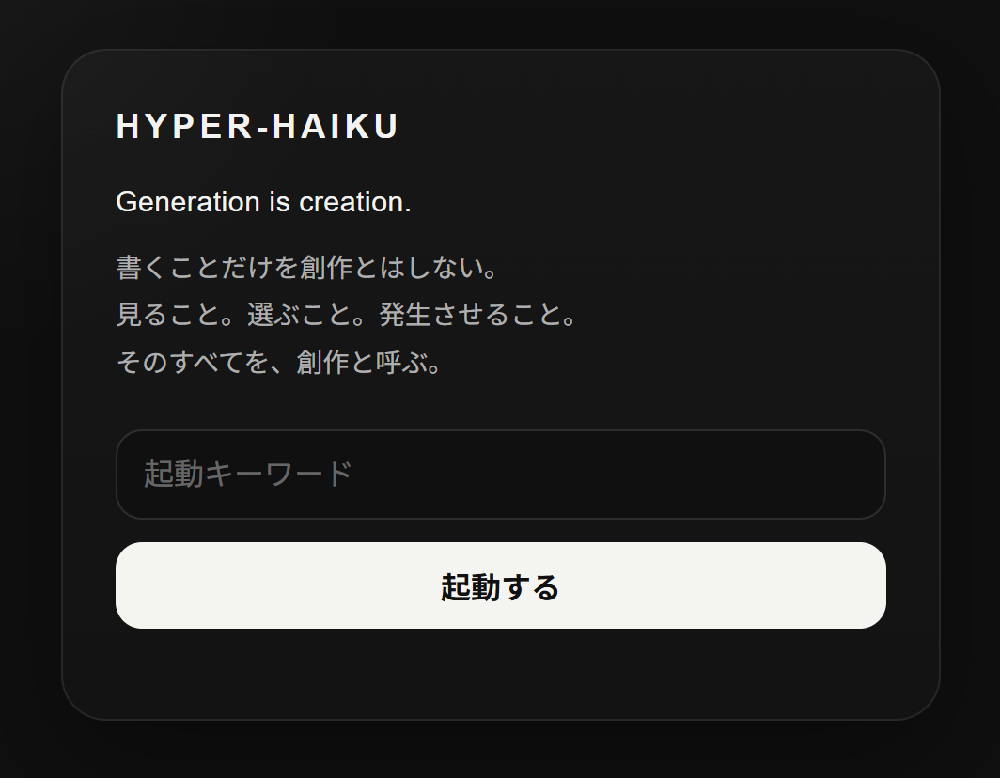
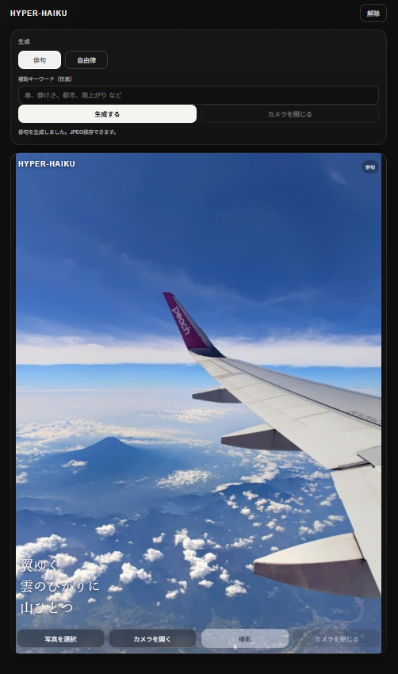
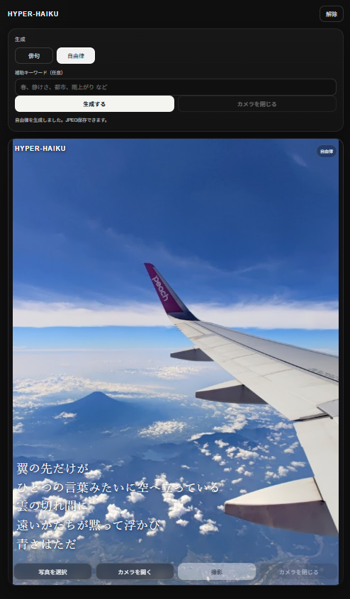

# HYPER-HAIKU

写真から俳句 / 自由律を生成し、写真の上に重ねて保存できる Cloudflare Pages アプリです。  
起動時にはキーワード入力が必要で、通過後はその端末で継続利用できます。

## 実行画面
https://hyper-haiku.pages.dev/

## Screenshot

### screenshot1

### screenshot2

### screenshot3

## 主な機能
- 起動キーワードゲート
- 写真選択
- カメラ起動 / 撮影
- 俳句 / 自由律 の切り替え
- 写真上への句の重ね表示
- HYPER-HAIKU ロゴの重ね表示
- JPEG保存
- Cloudflare Pages Functions + OpenAI API 連携

## コンセプト
> Generation is creation.  
> 書くことだけを創作とはしない。  
> 見ること。選ぶこと。発生させること。  
> そのすべてを、創作と呼ぶ。

## 使い方
1. 起動キーワードを入力してアプリを開きます。
2. 写真を選択するか、カメラを開いて撮影します。
3. `俳句` または `自由律` を選びます。
4. 必要なら補助キーワードを入れます。
5. `生成する` で句を作成します。
6. 写真の上に重なった表示を確認し、JPEGとして保存します。

## 生成ルール
- 季節はできるだけ**写真の視覚情報から判断**します。
- 雪、氷、花、新緑、紅葉、枯れ枝、服装、光、空気感など、**写真に見える情報を優先**します。
- 季節が曖昧なときは、春夏秋冬を決め打ちせず、光や色や距離感で書きます。
