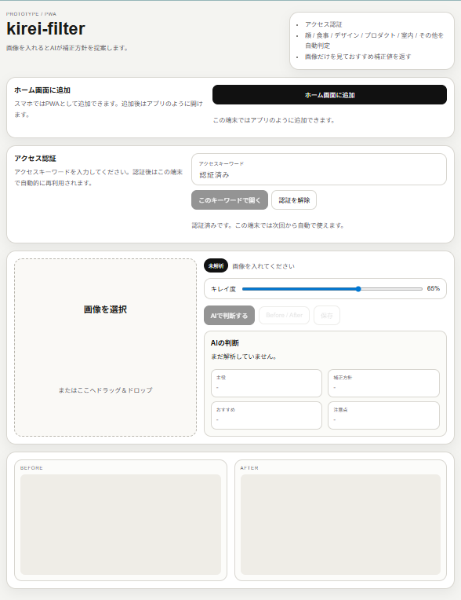

# kirei-filter

`kirei-filter` は、画像の内容を AI が見て、全体の画像補正をするアプリです。

公開ページ: [https://ai-kirei-filter.pages.dev/](https://ai-kirei-filter.pages.dev/)

## PWAのインストール方法

### iPhone / iPad（Safari）
1. `kirei-filter` のURLを **Safari** で開きます。  
2. 画面下の **共有ボタン** を押します。  
3. **「ホーム画面に追加」** を選びます。  
4. 名前を確認して **追加** を押します。  
5. ホーム画面に追加されたアイコンから起動してください。

### Android（Chrome）
1. `kirei-filter` のURLを **Chrome** で開きます。  
2. 右上メニューから **「ホーム画面に追加」** または **「アプリをインストール」** を選びます。  
3. 確認画面で **追加 / インストール** を押します。  
4. 追加後はホーム画面のアイコンから起動してください。

### うまく更新が反映されない場合
PWA は古いキャッシュが残ることがあります。表示が変わらない場合は、次を試してください。

1. ページを閉じて開き直す  
2. ブラウザで再読み込みする  
3. シークレットモードで開く  
4. ホーム画面版を削除して入れ直す

---

## 実行画面

---

## アプリ概要

対象の例:
- 顔写真
- 食事写真
- UI / デザイン画像
- プロダクト写真
- 室内や一般的な写真

この試作では、画像そのものを大きく作り変えるのではなく、**主役を壊さず、ノイズを減らす方向** を重視しています。

---

## 認証について
このアプリは、**最初の一回だけアクセス認証**して使う構成です。  
一度認証が通ると、その端末では次回以降自動で利用できます。

認証キーワードは公開していません。  
**必要な方には個別に PW をお知らせします。**

---

## 使い方
1. 初回のみアクセス認証を行います。  
2. 画像を選択します。  
3. AI が画像内容を判定します。  
4. 内容に応じて「整え」方向の補正提案を返します。  
5. 必要に応じて別画像でも試します。
